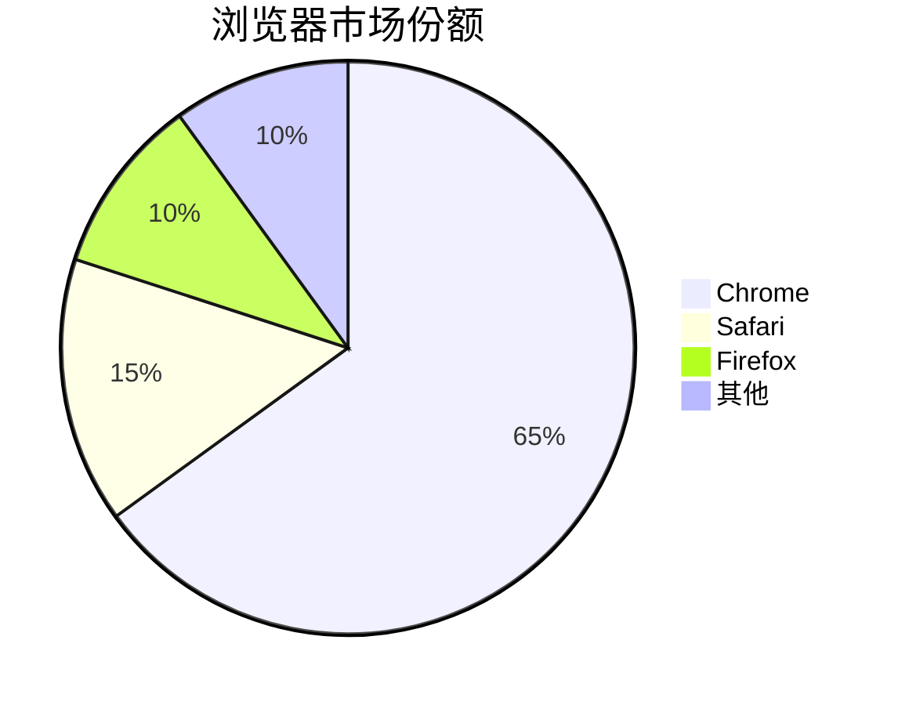

# Winston Churchill
**real**  
*real*  
***real***  

---  
~~erro~~  

<u>下划线文本</u>  

---  
### 这是一段实例[^文本]
[^文本]:text  


使用`import`调用库

```py
import pandas as pd
```

<mark>高亮文本</mark>  
这是一个段落

这是第二个段落

这是第三个段落

- 列表1  
- 列表2
  - 嵌套列表
  - 嵌套2  

1.  一级目录  
  - 二级目录  

-[ ] 未完成  
-[x]完成  

>床前明月光，疑是地上霜  

- 这是一个很长的列表项，  
  需要换行显示，注意第二行对齐

>Stay hungry,
>stay foolish.  


> &#x1f4da; **推荐阅读**
> 
> 详细信息请参考 [官方文档](https://example.com)
> 
> 


`<div>`

	缩进代码块
	前面有四个空格
	保持代码的原始格式

使用[github](https://www.github.com, 'github')

## 目录
- [第一章：介绍](#第一章:介绍)
- [第二章：安装](#第二章安装)
- [第三章：使用方法](#第三章使用方法)

# 第一章：介绍
这里是介绍内容...

# 第二章：安装
这里是安装说明...

# 第三章：使用方法
这里是使用说明...  


|1|2|
|---|---|
|x|y|

## LaTex公式
\f(x) = sin(x) + 12\


## 流程图
```mermaid
graph TD
	A[start] --> B{choose}
	B -->|YES| C[A]
	B -->|NO| D[B]
	C --> E[end]
	D --> end
```

